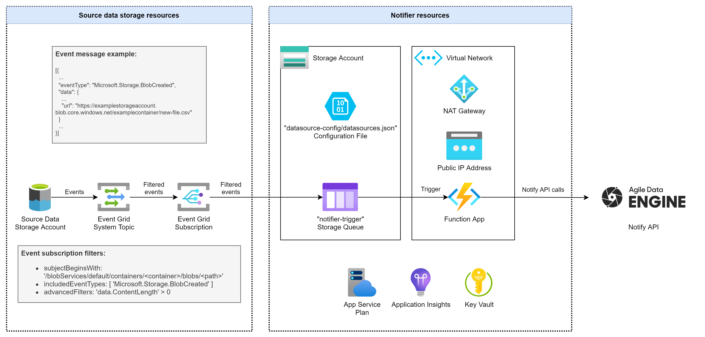
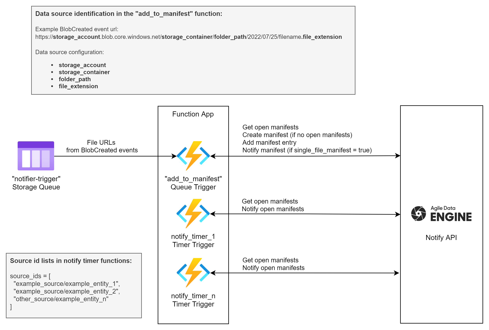

# Introduction
This repository contains a reference solution for notifying incoming source data files for Agile Data Engine Notify API (https://ade.document360.io/docs/notify-api) in Azure. 

**The repository is provided for reference purposes only and the solution may require modifications to fit your use case. Note that this solution is not part of the Agile Data Engine product. Please use at your own caution.**

**Contents:**
- Bicep templates for deploying required Azure resources
- Python functions for deploying a Notifier Function App

# Notifier architecture & process
Reference Notifier solution for Azure:



## Notifying process

1. Source data files are created into a Storage Account Blob Container by an external process (i.e. not Agile Data Engine nor the Notifier). This source data storage account is not part of the Notifier solution and must be managed separately.
2. There is an Event Grid System Topic on top of the storage account and an Event Grid Subscription filtering specific events from the system topic. These Event Grid resources are not part of the Notifier solution and must be managed separately. However, there are instructions on how to create/configure them below.
3. The Event Grid Subscription filters **BlobCreated** events with set parameters and feeds them to the **notifier-trigger** Storage Queue.
4. New messages in this queue trigger the [add_to_manifest](functionapp/add_to_manifest/__init__.py) function in the Function App.
5. The function gets the data source configuration file [datasource-config/datasources.json](config/datasources.json) from the Notifier storage account and compares the event url to the configured data sources.
6. If the data source is identified, the function calls Notify API to search for open manifests for the data source.
7. If open manifests are found, the function will add the file to the latest open manifest.
8. If open manifests are not found, a new one will be created and the file added there.
9. If **single_file_manifest** is set to **true**, the manifest will also be notified (closed).
10. Notification of data sources where **single_file_manifest** is set to **false** is done with timer functions which are triggered on a schedule (cron), i.e. files are collected to an open manifest until a schedule triggers the notification (closing) of that manifest.

Notifying process in detail:



## Notes

- [Azure Functions Premium plan](https://docs.microsoft.com/en-us/azure/azure-functions/functions-premium-plan) is used to enable virtual network connectivity and a static public IP with the NAT Gateway.
- Check up-to-date and region-specific pricing from [Azure documentation](https://azure.microsoft.com/en-us/pricing/calculator/). 
- Main cost drivers are the premium App Service Plan and the NAT Gateway.
- If you are deploying multiple environments and need to save costs, you can share the same ASP & network components between different Function Apps in different environments. This requires some changes to the Bicep template.

# Dependencies
The solution uses the [adenotifier](https://github.com/solita/adenotifier) Python library. Please specify a version in the [requirements.txt](functionapp/requirements.txt) to prevent issues with library upgrades.

# Deployment
## Prerequisites
### Event Grid System Topic
1. Create an Event Grid system topic for your source data storage account (if one does not exist yet) with one of the options:
    - In the portal: https://docs.microsoft.com/en-us/azure/event-grid/create-view-manage-system-topics
    - With Azure CLI https://docs.microsoft.com/en-us/azure/event-grid/create-view-manage-system-topics-cli
    - With a template, e.g. https://docs.microsoft.com/en-us/azure/event-grid/create-view-manage-system-topics-arm
2. Take note of the system topic name and resource group. These will be needed as Bicep template parameters.

### Deployment tools
1. Install Azure CLI: https://docs.microsoft.com/en-us/cli/azure/install-azure-cli
2. Install Bicep:
```Powershell
az bicep install
```
3. Install Azure Functions Core Tools: https://docs.microsoft.com/en-us/azure/azure-functions/functions-run-local
4. Log in to your AAD tenant and select subscription:
```Powershell
az login --tenant <tenantid>
az account set --subscription <subscriptionid>
```

## Azure resources
1. Go through the [Bicep template](bicep/main.bicep) and the [example parameter values](bicep/parameters_example.json). Format the template according to your needs and policies, set values for parameters.

2. Create a resource group (skip if using an existing resource group):
```Powershell
az group create --location westeurope --name <rgname>
```

3. Run what-if to preview deployment, check output:
```Powershell
az deployment group what-if --resource-group <rgname> --template-file ./bicep/main.bicep --parameters ./bicep/<parameter_file>.json
```

4. Run deployment:
```Powershell
az deployment group create --resource-group <rgname> --template-file ./bicep/main.bicep --parameters ./bicep/<parameter_file>.json
```

## Functions

Deploy function app:
```Powershell
cd functionapp
func azure functionapp publish <appname>
```

# Configuration
## Update Notify API secrets in Key Vault
The Key Vault secrets are deployed with dummy values and must be updated to the Notify API key and secret. Agile Data Engine support team will provide the secrets:
- notify-api-key
- notify-api-key-secret

Note that you will need to assign a Key Vault access policy that allows secret management to yourself or a security group that you belong to. See [Microsoft documentation](https://docs.microsoft.com/en-us/azure/key-vault/general/assign-access-policy) for detailed instructions.

## Provide the public IP addresses to Agile Data Engine support
Agile Data Engine support needs to add the public IP address to the allowed list before the deployed solution can connect to Notify API. If you have deployed multiple environments, provide IP addresses of each environment to the support team.

## Data source configuration
Configure data sources into a configuration file **datasources.json** and upload it to the deployed storage account to path **datasource-config/datasources.json**. See specifications for the configuration format in the [adenotifier library readme](https://github.com/solita/adenotifier). Additionally configure the following attributes which are used for identifying the data source from incoming BlobCreated events:

| Attribute  | Mandatory | Description |
| --- | --- | --- |
| storage_account  | x | Storage account name of the source file. |
| storage_container  | x | Blob container name of the source file. |
| folder_path  | x | Folder path of the source file. |
| file_extension  | | Optional: File extension of the source file. |

See configuration examples in [config/datasources.json](config/datasources.json).

## Event Grid subscription
To get BlobCreated events from the source data storage account to the notifier queue, an Event Grid subscription is needed. You can create an event subscription in Azure Portal or by using the provided Bicep template. More details are available in [Microsoft documentation](https://docs.microsoft.com/en-us/azure/event-grid/event-schema-blob-storage?tabs=event-grid-event-schema).

Use at least the following settings when creating the event subscription:
| Setting | Value | Notes |
| --- | --- | --- |
| Event schema | Event Grid Schema | - |
| Event types | Blob Created | - |
| Endpoint type | Storage queues | - |
| Managed identity type | System assigned | - |
| Enable subject filtering | true | - |
| Subject begins with | /blobServices/default/containers/source-data-container-name/blobs/optional-path-to-files | Set optional-path-to-files if you do not want events from the entire container. | - |
| Advanced filters: data.ContentLength | > 0 | This prevents duplicate events. |

There is a [Bicep template](config/event_subscription.bicep) and an example [parameter file](config/parameters_example.json) in the **config** folder which can be used to deploy the subscription. Format the template and set the parameters according to your setup.

Deploy the Event Grid subscription like the other resources above with:
```Powershell
az deployment group create --resource-group <systemtopicrgname> --template-file ./config/event_subscription.bicep --parameters ./config/<parameter_file>.json
```

## Timer trigger functions
Notification of manifests of data sources where **single_file_manifest** is set to **false** must be scheduled with a timer trigger function. Otherwise files would only be collected to manifests, but the manifests would never be closed and loaded by Agile Data Engine.

Use the [notify_timer_example](functionapp/notify_timer_example/__init__.py) function as reference and create as many timer trigger functions as needed. Duplicate the timer trigger function folder (e.g. notify_timer_example), set the schedule with a cron expression in [function.json](functionapp/notify_timer_example/function.json) and define a list of data sources to be notified in the **source_ids** variable in [__init.py__](functionapp/notify_timer_example/__init__.py). Source ids point to the source ids defined in the [datasources.json](config/datasources.json) configuration file.